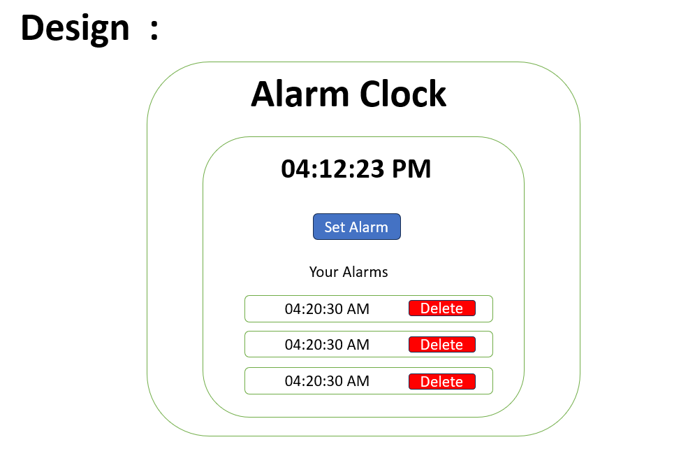

# Alarm Clock 

# Live link - https://maheshh-busam.github.io/alarm-clock/

## Table of Contents
- [Introduction](#introduction)
- [Features](#features)
- [Design](#design)
- [Installation](#installation)
- [Usage](#usage)
- [Contact](#contact)

## Introduction
The Alarm Clock project is a simple web application designed to help users set alarms and receive an alert at specified times.

## Features
- Shows the Current time.
- Set multiple alarms.
- User-friendly interface.
- Can delete alarms at any time.

## Design

Initial page--


On click of Set Alarm--


Added Alarms in list--



## Installation
To run this project locally, follow these steps:

1. Clone the repository:
    ```sh
    git clone https://github.com/Maheshh-Busam/alarm-clock.git
    ```
2. Navigate to the project directory:
    ```sh
    cd alarm-clock
    ```
## Usage
To start the application, follow the below process..
```sh
    you can open with live server as per your code eidtor.
```

## Contact
Email Id - mahesh.busam2206@gmail.com
